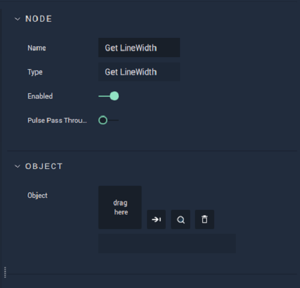

# Get LineWidth

## Overview

The **Get LineWidth Node** returns the **LineWidth** of a **Line Object** created in the **Scene Outliner Module** under **Vector**.

## Attributes

| Attribute | Type | Description |
| :--- | :--- | :--- |
| `Object` | **ObjectID** | The target **Object**. |

## Inputs

| Input | Type | Description |
| :--- | :--- | :--- |
| _Pulse Input_ \(►\) | **Pulse** | A standard **Input Pulse**, to trigger the execution of the **Node**. |
| `Object ID` | **ObjectID** | The ID of the target **Object**. |

## Outputs

| Output | Type | Description |
| :--- | :--- | :--- |
| _Pulse Output_ \(►\) | **Pulse** | A standard **Output Pulse**, to move onto the next **Node** along the **Logic Branch**, once this **Node** has finished its execution. |
| `LineWidth` | **Int** | The **LineWidth** of the target **Object**. |

## See Also

* [**Set LineWidth**](setlinewidth.md)

