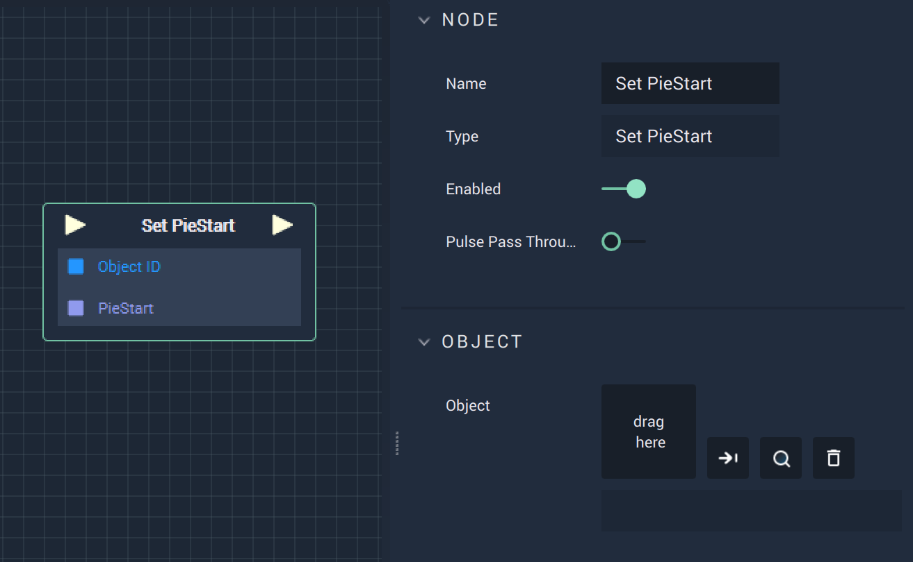

# Overview

The **Set PieStart Node** sets the starting *degree value* of a **Pie Object** created in the **Scene Outliner Module** under *Vector*.

# Attributes

|Attribute|Type|Description|
|---|---|---|
|`Object`|**ObjectID**|The target **Object**.|

# Inputs

|Input|Type|Description|
|---|---|---|
|*Pulse Input* (►)|**Pulse**|A standard **Input Pulse**, to trigger the execution of the **Node**.|
|`Object ID`|**ObjectID**|The ID of the target **Object**.|
|`PieStart`|**Float**|The starting *degree value*.|

# Outputs

|Output|Type|Description|
|---|---|---|
|*Pulse Output* (►)|**Pulse**|A standard **Output Pulse**, to move onto the next **Node** along the **Logic Branch**, once this **Node** has finished its execution.|

# See Also

* [**Set PieEnd**](setpieend.md)
* [**Get PieStart**](getpiestart.md)
* [**Get PieEnd**](getpieend.md)

