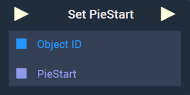
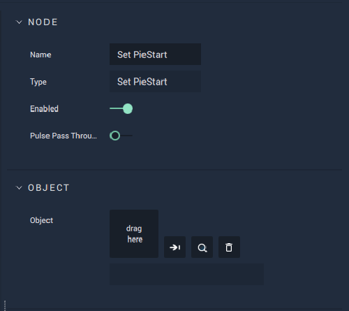

# Set PieStart

## Overview

The **Set PieStart Node** sets the starting _degree value_ of a **Pie Object** created in the **Scene Outliner Module** under **Vector**.

[**Scope**](../../../overview.md#scopes): **Scene**, **Function**, **Prefab**.

## Attributes

| Attribute | Type | Description |
| :--- | :--- | :--- |
| `Object` | **ObjectID** | The target **Object**. |

## Inputs

| Input | Type | Description |
| :--- | :--- | :--- |
| _Pulse Input_ \(►\) | **Pulse** | A standard **Input Pulse**, to trigger the execution of the **Node**. |
| `Object ID` | **ObjectID** | The ID of the target **Object**. |
| `PieStart` | **Float** | The starting _degree value_. |

## Outputs

| Output | Type | Description |
| :--- | :--- | :--- |
| _Pulse Output_ \(►\) | **Pulse** | A standard **Output Pulse**, to move onto the next **Node** along the **Logic Branch**, once this **Node** has finished its execution. |

## See Also

* [**Set PieEnd**](setpieend.md)
* [**Get PieStart**](getpiestart.md)
* [**Get PieEnd**](getpieend.md)

