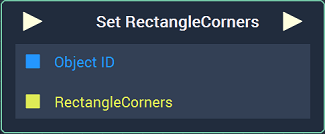
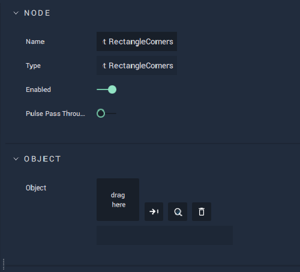

# Set RectangleCorners

## Overview

The **Set RectangleCorners Node** sets the **Corners** of a **Rectangle Object** created in the **Scene Outliner Module** under **Vector**. **Corners** are **Vector2** type **Variables**.

## Attributes

| Attribute | Type | Description |
| :--- | :--- | :--- |
| `Object` | **ObjectID** | The target **Object**. |

## Inputs

| Input | Type | Description |
| :--- | :--- | :--- |
| _Pulse Input_ \(►\) | **Pulse** | A standard **Input Pulse**, to trigger the execution of the **Node**. |
| `Object ID` | **ObjectID** | The ID of the target **Object**. |
| `RectangleCorners` | **Vector2** | The **RectangleCorners** of the target **Object**. |

## Outputs

| Output | Type | Description |
| :--- | :--- | :--- |
| _Pulse Output_ \(►\) | **Pulse** | A standard **Output Pulse**, to move onto the next **Node** along the **Logic Branch**, once this **Node** has finished its execution. |

## See Also

* [**Get RectangleCorners**](getrectanglecorners.md)

