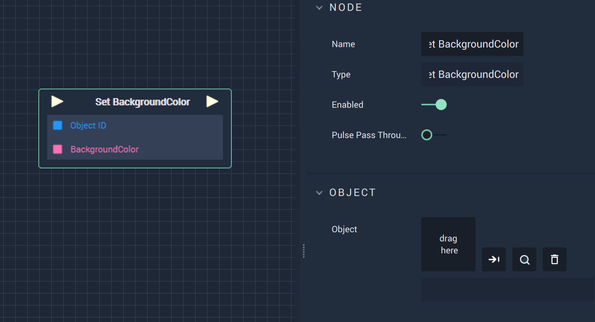

# Overview

The **Set BackgroundColor Node** sets the **BackgroundColor** of the target **Vector Object**.  

# Attributes

|Attribute|Type|Description|
|---|---|---|
| `Object` | **Object ID** | The target **Object**. |

# Inputs

|Input|Type|Description|
|---|---|---|
|*Pulse Input* (►)|**Pulse**|A standard **Input Pulse**, to trigger the execution of the **Node**.|
| `Object ID` | **Object ID** | The ID of the target **Object**.|
|`BackgroundColor`|**Color**| The **BackgroundColor** of the target **Object**.|

# Outputs

|Output|Type|Description|
|---|---|---|
|*Pulse Output* (►)|**Pulse**|A standard **Output Pulse**, to move onto the next **Node** along the **Logic Branch**, once this **Node** has finished its execution.|

