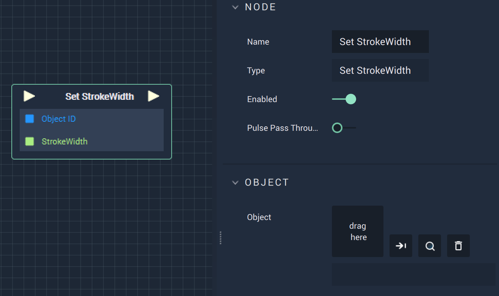

# Overview

The **Set StrokeWidth Node** sets the **StrokeWidth** of a **Vector Object**, such as an **Ellipse**. **StrokeWidth** is an **Attribute** of a **Vector Object** that is visualized as the outside line of the **Object**.  

# Attributes

|Attribute|Type|Description|
|---|---|---|
| `Object` | **ObjectID** | The target **Object**. |

# Inputs

|Input|Type|Description|
|---|---|---|
|*Pulse Input* (►)|**Pulse**|A standard **Input Pulse**, to trigger the execution of the **Node**.|
| `Object ID` | **ObjectID** | The ID of the target **Object**. |
|`StrokeWidth`|**Int**| The **StrokeWidth** of the target **Object**.|

# Outputs

|Output|Type|Description|
|---|---|---|
|*Pulse Output* (►)|**Pulse**|A standard **Output Pulse**, to move onto the next **Node** along the **Logic Branch**, once this **Node** has finished its execution.|

# See Also

* [**Get StrokeWidth**](getstrokewidth.md)

