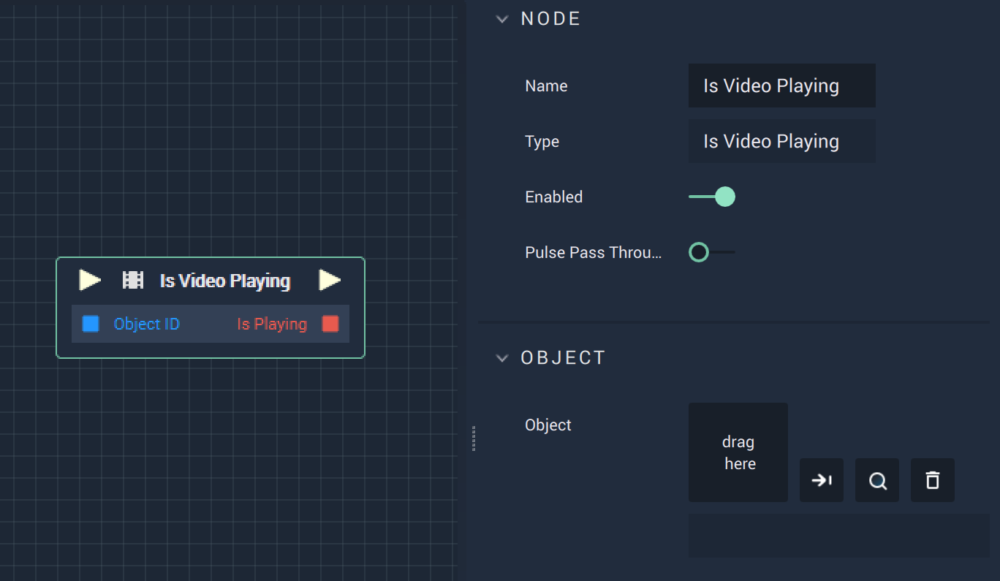

# Is Video Playing

## Overview

**Is Video Playing** is a _video_ **Node** that can be found under the _incari_ **Category**. It returns a **Bool**, or boolean, of true or false for the selected video.

## Attributes

| Attribute | Type | Description |
| :--- | :--- | :--- |
| `Object` | **Object** | The video file the user wishes to reference. |

## Inputs

| Input | Type | Description |
| :--- | :--- | :--- |
| _Pulse Input_ \(►\) | **Pulse** | A standard **Input Pulse**, to trigger the execution of the **Node**. |
| `ObjectID` | **Object** | The **Scene Object** the user wishes to reference. |

## Outputs

| Output | Type | Description |
| :--- | :--- | :--- |
| _Pulse Output_ \(►\) | **Pulse** | A standard **Output Pulse**, to move onto the next **Node** along the **Logic Branch**, once this **Node** has finished its execution. |
| `isPlaying` | **Bool** | Returns **True** if the video is playing, **False** if not. Returns **None** if there is no file or **Scene Object**. |

