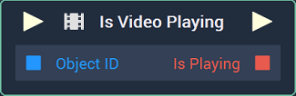
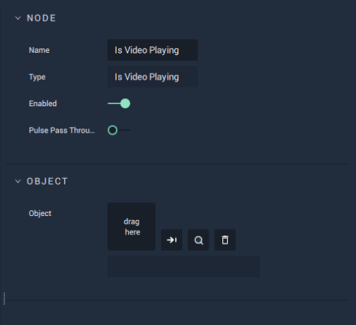

# Is Video Playing

## Overview

**Is Video Playing** is a video **Node** returning a **Boolean** value, depending on whether the selected video is playing or not.

*Scope*: **Scene**, **Function**, **Prefab**

## Attributes

| Attribute | Type | Description |
| :--- | :--- | :--- |
| `Object` | **ObjectID** | The target **Object**. |

## Inputs

| Input | Type | Description |
| :--- | :--- | :--- |
| _Pulse Input_ \(►\) | **Pulse** | A standard **Input Pulse**, to trigger the execution of the **Node**. |
| `Object ID` | **ObjectID** | The ID of the target **Object**. |

## Outputs

| Output | Type | Description |
| :--- | :--- | :--- |
| _Pulse Output_ \(►\) | **Pulse** | A standard **Output Pulse**, to move onto the next **Node** along the **Logic Branch**, once this **Node** has finished its execution. |
| `is Playing` | **Bool** | Returns **True** if the video is playing, **False** if not. Returns **None** if there is no file or **Scene Object**. |

## See Also

* [**Play Video**](playvideo.md)
* [**Pause Video**](pausevideo.md)
* [**Seek Video**](seekvideo.md)
* [**Stop Video**](stopvideo.md)

