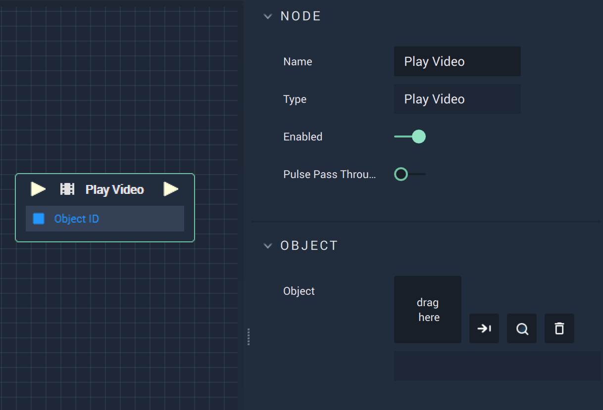

# Overview

The **Play Video** **Node** can be used to play a specified video file during the session. This can be added through the file library to the right, or as an **Object** from a **Scene**.

# Attributes

|Attribute|Type|Description|
|---|---|---|
|`ObjectID`| **Object** | The video file or **Scene Object** the user wishes to reference|

# Inputs

|Input|Type|Description|
|---|---|---|
|*Pulse Input* (►)|**Pulse**|A standard **Input Pulse**, to trigger the execution of the **Node**.|

# Outputs

|Output|Type|Description|
|---|---|---|
|*Pulse Output* (►)|**Pulse**|A standard **Output Pulse**, to move onto the next **Node** along the **Logic Branch**, once this **Node** has finished its execution.|
