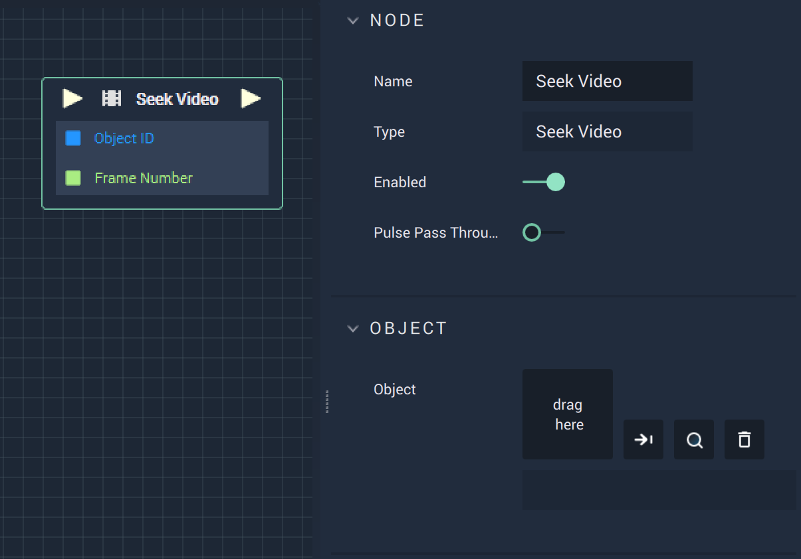

# Overview

The **Seek Video** **Node** can be used to go to a certain timeframe of a specified video by providing a variable for the `Frame Number`. 

# Attributes

|Attribute|Type|Description|
|---|---|---|
|`Object`| **Object** | The video file the user wishes to reference.|

# Inputs

|Input|Type|Description|
|---|---|---|
|*Pulse Input* (►)|**Pulse**|A standard **Input Pulse**, to trigger the execution of the **Node**.|
|`ObjectID`| **Object** | The **Scene Object** the user wishes to reference.|
|`Frame Number`| **Int**| The timeframe of the video the user wishes to reference.|

# Outputs

|Output|Type|Description|
|---|---|---|
|*Pulse Output* (►)|**Pulse**|A standard **Output Pulse**, to move onto the next **Node** along the **Logic Branch**, once this **Node** has finished its execution.|