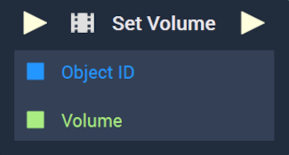

# Overview

The **Set Volume Node** sets the current volume of a **Video** in the **Logic Editor**. This does not change the `Volume` **Attribute** however. 

[**Scope**](../../overview.md#scopes): **Scene**, **Function**, **Prefab**.

# Inputs

|Input|Type|Description|
|---|---|---|
|*Pulse Input* (►)|**Pulse**|A standard **Input Pulse**, to trigger the execution of the **Node**.|
|`Object ID`|**ObjectID**|The **Video Object** whose volume will be set.|
|`Volume`|Int|The integer value of the desired volume.|

# Outputs

|Output|Type|Description|
|---|---|---|
|*Pulse Output* (►)|**Pulse**|A standard **Output Pulse**, to move onto the next **Node** along the **Logic Branch**, once this **Node** has finished its execution.|

# See Also

* [**Get Volume**](getvolume.md)
