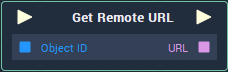

# Overview

**Get Remote Url** returns the URL of a **Web Sprite** **Object**. The **Object ID** is given as input to the **Node**.

# Attributes

## Object

|Attribute|Type|Description|
|---|---|---|
| `Object` | **ObjectID** | The **Web Sprite** **Object** whose URL you wish to return, if none is given in the  `Object ID` **Socket**. |

# Inputs

|Input|Type|Description|
|---|---|---|
|*Pulse Input* (►)|**Pulse**|A standard **Input Pulse**, to trigger the execution of the **Node**.|
| `Object ID` | **ObjectID** | The **Web Sprite** **Object** whose URL you wish to return. |

# Outputs

|Output|Type|Description|
|---|---|---|
|*Pulse Output* (►)|**Pulse**|A standard **Output Pulse**, to move onto the next **Node** along the **Logic Branch**, once this **Node** has finished its execution.|
| `URL` | **String** | The URL of the **Web Sprite** **Object**. |

# See Also

* [**WebSprite**](README.md)
* [**Set Remote URL**](set-remote-url.md)

