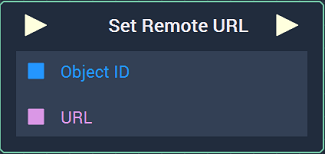
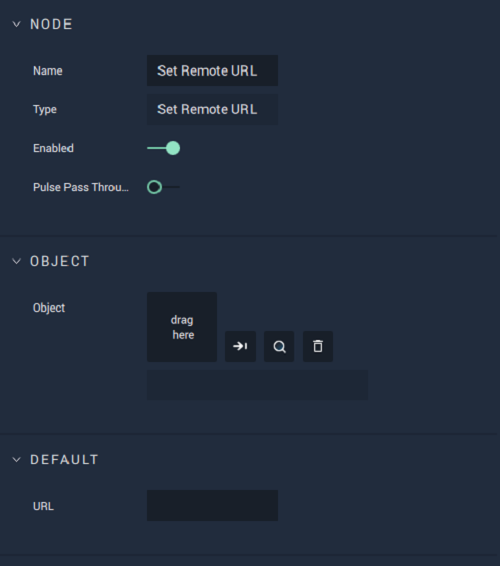

# Overview

**Set Remote URL** sets the URL **Attribute** of a **Web Sprite** **Object**. It receives as inputs the **Object ID** of the **Web Sprite** **Object** and the URL.

[**Scope**](../../overview.md#scopes):**Scene**, **Function**, **Prefab**.

# Attributes

## Object

|Attribute|Type|Description|
|---|---|---|
| `Object` | **ObjectID** | The **Web Sprite Object** whose URL you wish to set, if none is given in the `Object ID` **Socket**. |

## Default

|Attribute|Type|Description|
|---|---|---|
| `URL` | **String** | Default value of the URL you wish to set the **Web Sprite** **Object** to, if none is given in the **Input Socket**. |

# Inputs

|Input|Type|Description|
|---|---|---|
|*Pulse Input* (►)|**Pulse**|A standard **Input Pulse**, to trigger the execution of the **Node**.|
| `Object ID` | **ObjectID** | The **Web Sprite** **Object** whose URL you wish to set. |
| `URL` | **String** | The URL you wish to set the **Web Sprite** **Object** to. |

# Outputs

|Output|Type|Description|
|---|---|---|
|*Pulse Output* (►)|**Pulse**|A standard **Output Pulse**, to move onto the next **Node** along the **Logic Branch**, once this **Node** has finished its execution.|

# See Also

* [**Web Sprite Objects**](../../../objects-and-types/scene-objects/web-sprite.md)
* [**WebSprite Nodes**](README.md)
* [**Get Remote URL**](get-remote-url.md)

