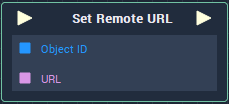

# Overview

**Set Remote URL** sets the URL **Attribute** of a **Web Sprite** **Object**. It receives as inputs the **Object ID** of the **Web Sprite** **Object** and the URL.

# Attributes

## Object

|Attribute|Type|Description|
|---|---|---|

## Default

# Inputs

|Input|Type|Description|
|---|---|---|
|*Pulse Input* (►)|**Pulse**|A standard **Input Pulse**, to trigger the execution of the **Node**.|

# Outputs

|Output|Type|Description|
|---|---|---|
|*Pulse Output* (►)|**Pulse**|A standard **Output Pulse**, to move onto the next **Node** along the **Logic Branch**, once this **Node** has finished its execution.|

# See Also

* [**Web Sprite Object**](../../../getting-started/scene-objects/web-sprite.md)
* [**WebSprite Nodes**](README.md)
* [**Get Remote URL**](get-remote-url.md)

