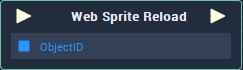

# Overview

The **Web Sprite Reload** **Node** reloads a **Web Sprite** **Object** when triggered.

# Attributes

## Object

|Attribute|Type|Description|
|---|---|---|
| `Object` | **ObjectID** | The **Web Sprite** **Object** you wish to reload, if none is given in the `ObjectID` **Socket**. |

# Inputs

|Input|Type|Description|
|---|---|---|
|*Pulse Input* (►)|**Pulse**|A standard **Input Pulse**, to trigger the execution of the **Node**.|
| `ObjectID` | **ObjectID** | The **Web Sprite** **Object** you wish to reload. |

# Outputs

|Output|Type|Description|
|---|---|---|
|*Pulse Output* (►)|**Pulse**|A standard **Output Pulse**, to move onto the next **Node** along the **Logic Branch**, once this **Node** has finished its execution.|

# See Also

* [**Web Sprite Objects**](../../../getting-started/scene-objects/web-sprite.md)
* [**WebSprite Nodes**](README.md)

