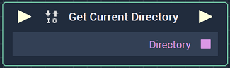

# Overview

The **Get Current Directory Node**  returns the current *directory* that is currently is use. If no *directory* has been explicitly set, it returns the default, which is the `Assets` folder of the current **Project**. 

# Inputs

|Input|Type|Description|
|---|---|---|
|*Pulse Input* (►)|**Pulse**|A standard **Input Pulse**, to trigger the execution of the **Node**.|

# Outputs

|Output|Type|Description|
|---|---|---|
|*Pulse Output* (►)|**Pulse**|A standard **Output Pulse**, to move onto the next **Node** along the **Logic Branch**, once this **Node** has finished its execution.|
|`Directory`|**String**|The path name of the current working *directory*.|

# See Also

* [**Set Current Directory**](setcurrentdirectory.md)

