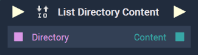

# Overview

The **List Directory Content** returns all the folder and file contents of the *directory* given as input.

[**Scope**](../overview.md#scopes): **Project**, **Scene**, **Function**, **Prefab**.

# Inputs

|Input|Type|Description|
|---|---|---|
|*Pulse Input* (►)|**Pulse**|A standard **Input Pulse**, to trigger the execution of the **Node**.|
|`Directory`|**String**|The *directory* whose contents will be returned.|

# Outputs

|Output|Type|Description|
|---|---|---|
|*Pulse Output* (►)|**Pulse**|A standard **Output Pulse**, to move onto the next **Node** along the **Logic Branch**, once this **Node** has finished its execution.|
|`Content`|**Array**|The contents of the specified *directory*, in **Array** form.|

# See Also

* [**Get Current Directory**](getcurrentdirectory.md)
* [**Set Current Directory**](setcurrentdirectory.md)
