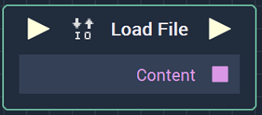
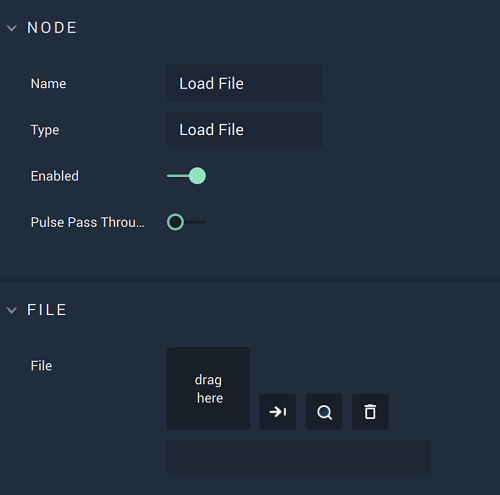

# Load File

## Overview

**Load File** is an _io_ **Node**, which allows one to load a specified file, such as a previously saved **Variable** or a **Dictionary**. In the latter case, the **JSON Parser** must be used first.

[**Scope**](../overview.md#scopes): **Project**, **Scene**, **Function**, **Prefab**.

## Attributes

| Attribute | Type | Description |
| :--- | :--- | :--- |
| `File` | **User Input** | The user can drag a file from their library or select a file from a file tree. The icons to the right allow the user to confirm the selection, highlight the **Asset** in the **Asset Manager**, and remove the selection. |

## Inputs

| Input | Type | Description |
| :--- | :--- | :--- |
| _Pulse Input_ \(►\) | **Pulse** | A standard **Input Pulse**, to trigger the execution of the **Node**. |

## Outputs

| Output | Type | Description |
| :--- | :--- | :--- |
| _Pulse Output_ \(►\) | **Pulse** | A standard **Output Pulse**, to move onto the next **Node** along the **Logic Branch**, once this **Node** has finished its execution. |
| `Content` | Defined in the **Logic Editor** | The **Project** content that is to be loaded. |

