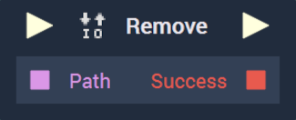

# Overview

The **Remove** **Node** deletes a file specified by the user. The file _path_ has to be given as input and the output is a **Boolean** indicating whether the operation was successful.

[**Scope**](../overview.md#scopes): **Project**, **Scene**, **Function**, **Prefab**.

# Inputs

|Input|Type|Description|
|---|---|---|
|*Pulse Input* (►)|**Pulse**|A standard **Input Pulse**, to trigger the execution of the **Node**.|
| `Path` | **String** | The _path_ of the file to be removed. |

# Outputs

|Output|Type|Description|
|---|---|---|
|*Pulse Output* (►)|**Pulse**|A standard **Output Pulse**, to move onto the next **Node** along the **Logic Branch**, once this **Node** has finished its execution.|
| `Success` | **Bool** | Returns _true_ or _false_, depending on whether the file removal was successful. |

# See Also

* [**Create File**](createfile.md)
* [**List Directory Content**](listdirectorycontent.md)

