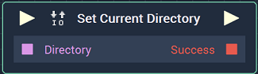

# Overview

The **Set Current Directory Node** allows the user to change the current *directory*. It returns a **Boolean** of *true* or *false*, depending on if this setting was successful or not. 

# Inputs

|Input|Type|Description|
|---|---|---|
|*Pulse Input* (►)|**Pulse**|A standard **Input Pulse**, to trigger the execution of the **Node**.|
|`Directory`|**String**|The path name of the desired current working *directory*.|

# Outputs

|Output|Type|Description|
|---|---|---|
|*Pulse Output* (►)|**Pulse**|A standard **Output Pulse**, to move onto the next **Node** along the **Logic Branch**, once this **Node** has finished its execution.|
|`Success`|**Boolean**|Returns *true* or *false*, depending on whether the current working *directory* was successfully set or not.|

# See Also

* [**Get Current Directory**](getcurrentdirectory.md)

