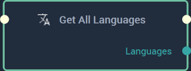

# Overview

The **Get All Languages Node** returns all languages contained in the `.local` file provided in the [**Project Settings.**](../../modules/project-settings/localization.md).

[**Scope**](../overview.md#scopes): **Project**, **Scene**, **Function**, **Prefab**.

# Inputs

|Input|Type|Description|
|---|---|---|
|*Pulse Input* (►)|**Pulse**|A standard **Input Pulse**, to trigger the execution of the **Node**.|

# Outputs

|Output|Type|Description|
|---|---|---|
|*Pulse Output* (►)|**Pulse**|A standard **Output Pulse**, to move onto the next **Node** along the **Logic Branch**, once this **Node** has finished its execution.|
|`Languages`|**Array**|Returns an array of all languages present in the `.local` file.|

