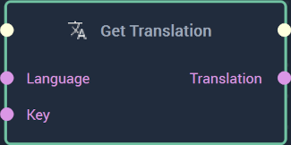

# Overview

The **Get Translation Node** takes a language and a key as input and outputs the appropriate translation. The language and key should be of those referenced in the `.local` file provided in the [**Project Settings.**](../../modules/project-settings/localization.md). 

[**Scope**](../overview.md#scopes): **Project**, **Scene**, **Function**, **Prefab**. 

# Inputs

|Input|Type|Description|
|---|---|---|
|*Pulse Input* (►)|**Pulse**|A standard **Input Pulse**, to trigger the execution of the **Node**.|
|`Language`|**String**|The desired language the user wishes to translate to.|
|`Key`|**String**|The desired key the user wishes to get the translation for.|

# Outputs

|Output|Type|Description|
|---|---|---|
|*Pulse Output* (►)|**Pulse**|A standard **Output Pulse**, to move onto the next **Node** along the **Logic Branch**, once this **Node** has finished its execution.|
|`Translation`|**String**|The outputted translation of the key in the desired language.|

