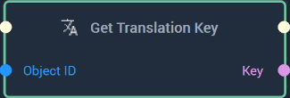

# Overview

The **Get Translation Key Node** returns the key referenced by the inputted **Object**.

[**Scope**](../overview.md#scopes): **Project**, **Scene**, **Function**, **Prefab**. 

# Inputs

|Input|Type|Description|
|---|---|---|
|*Pulse Input* (►)|**Pulse**|A standard **Input Pulse**, to trigger the execution of the **Node**.|
|`Object ID`|**ObjectID**|The ID of the **Object** the user wishes to get the key from.|

# Outputs

|Output|Type|Description|
|---|---|---|
|*Pulse Output* (►)|**Pulse**|A standard **Output Pulse**, to move onto the next **Node** along the **Logic Branch**, once this **Node** has finished its execution.|
|`Key`|**String**|The outputted translation key.|

# See Also

* [**Set Translation Key**](settranslationkey.md)
