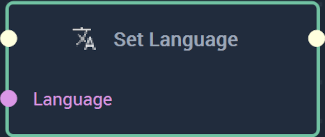
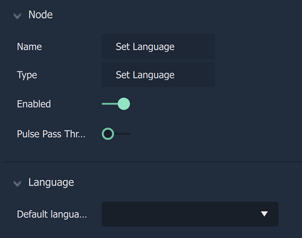

# Overview

The **Set Language Node** sets the language being used on the execution of the **Node**. It is selected in its **Attributes**.

[**Scope**](../overview.md#scopes): **Project**, **Scene**, **Function**, **Prefab**. 

# Attributes

|Attribute|Type|Description|
|---|---|---|
|`Language`|**String**|The language to be set during the execution of the **Node**.|

# Inputs

|Input|Type|Description|
|---|---|---|
|*Pulse Input* (►)|**Pulse**|A standard **Input Pulse**, to trigger the execution of the **Node**.|

# Outputs

|Output|Type|Description|
|---|---|---|
|*Pulse Output* (►)|**Pulse**|A standard **Output Pulse**, to move onto the next **Node** along the **Logic Branch**, once this **Node** has finished its execution.|

# See Also

* [**Get Language**](getlanguage.md)

