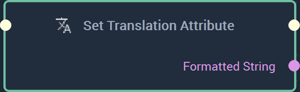
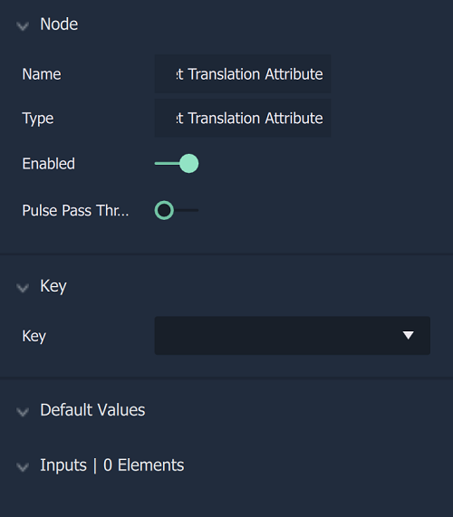

# Overview

The **Set Translation Attribute Node** allows the user to set a new item for a specific key. The default values appear when a `Key` is selected in the **Attributes** and corresponds to the **Inputs** of the **Node**.

[**Scope**](../overview.md#scopes): **Project**, **Scene**, **Function**, **Prefab**. 

# Attributes

|Attribute|Type|Description|
|---|---|---|
|`Key`|
|`Default Values`|**Element**|The element, or elements, to be set as a new **Translation Attribute** if none are already provided in the **Input Socket**.|

# Inputs

|Input|Type|Description|
|---|---|---|
|*Pulse Input* (►)|**Pulse**|A standard **Input Pulse**, to trigger the execution of the **Node**.|
|Input is generated from `Default Value` **Attribute**|**String**|Corresponds to the `Input Elements` shown in the `Default Value` **Attribute**. These appear when a `Key` is chosen.|

# Outputs

|Output|Type|Description|
|---|---|---|
|*Pulse Output* (►)|**Pulse**|A standard **Output Pulse**, to move onto the next **Node** along the **Logic Branch**, once this **Node** has finished its execution.|

# See Also

# External Links

