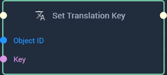
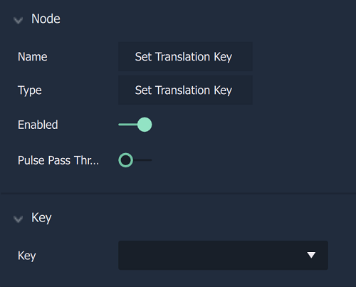

# Overview

The **Set Translation Key** sets the  translation `Key` for a specific **Object**.

[**Scope**](../overview.md#scopes): **Project**, **Scene**, **Function**, **Prefab**. 

# Attributes

|Attribute|Type|Description|
|---|---|---|
|`Key`|**Dropdown**|The key that the user wishes to set for the given **Object** if one is not added to the **Input Socket**. The possible keys come from the `.local` file inputted in the [**Project Settings**](../../modules/project-settings/localization.md).|

# Inputs

|Input|Type|Description|
|---|---|---|
|*Pulse Input* (►)|**Pulse**|A standard **Input Pulse**, to trigger the execution of the **Node**.|
|`Object ID`|**ObjectID**|The **Object** that the user wishes to set the key for.|
|`Key`|**String**|The key that the user wishes to set for the given **Object**.| 

# Outputs

|Output|Type|Description|
|---|---|---|
|*Pulse Output* (►)|**Pulse**|A standard **Output Pulse**, to move onto the next **Node** along the **Logic Branch**, once this **Node** has finished its execution.|

# See Also

* [**Get Translation Key**](gettranslation.md)

