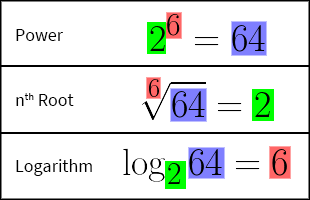

# Exponentiation

**INCARI** has several **Nodes** for performing functions relating to *exponentiation*. They all take two *known* parameters and return the 3rd *unknown* value. These **Nodes** are:

- [**Power**](power.md) - Multiplies the *base* value, against itself, a number of times defined by the *exponent*.
- [**Root**](root.md) - Calculates the *nth root* of a *base* value, where *n* is defined by the *degree*.
- [**Logarithm**](logarithm.md) - Calculates the *exponent* to which the *base* value needs to be raised, to yield the input value.

