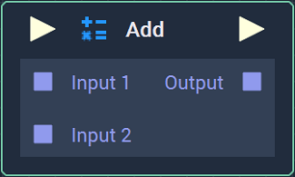
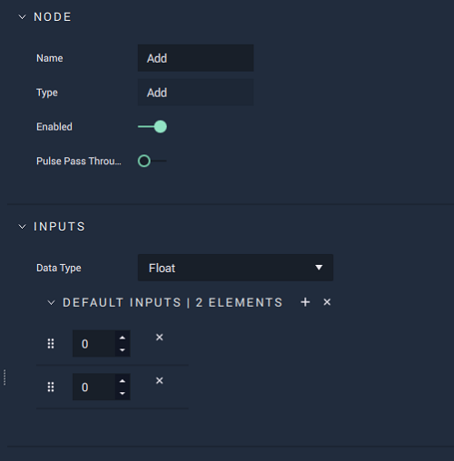

# Add

## Overview

**Add** is a _basic arithmetic operation_ **Node** that returns the sum of all of the values provided in the `Input` **Sockets**.

This is the equivalent of the addition \(`+`\) operation in computer science and mathematics.

[**Scope**](../overview.md#scopes):
*  **Project**, **Scene**, **Function**, **Prefab**

## Attributes

| Attribute | Type | Description |
| :--- | :--- | :--- |
| `Data Type` | **Drop-down** | The type of data that will be plugged into the `Input` **Sockets**. |
| `Default Inputs` | _Defined in the `Data Type` **Attribute**_. | The amount of `Input` **Sockets** and their default values, if they have no data connected to them. |

## Inputs

| Input | Type | Description |
| :--- | :--- | :--- |
| _Pulse Input_ \(►\) | **Pulse** | A standard input **Pulse**, to trigger the execution of the **Node**. |
| `Input [n]` | _Defined in the `Data Type` **Attribute**_. | The values to be added together. |

## Outputs

| Output | Type | Description |
| :--- | :--- | :--- |
| _Pulse Output_ \(►\) | **Pulse** | A standard output **Pulse**, to move onto the next **Node** along the **Logic Branch**, once this **Node** has finished its execution. |
| `Output` | _Defined in the `Data Type` **Attribute**_. | The sum of all of the values provided in the `Input` **Sockets**. |

