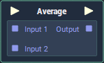

# Overview

**Average** calculates and returns the *arithmetic mean* of all of its inputs.

The *arithmetic mean* is the *sum* of all values in a set, divided by the total amount of numbers in that set.

# Attributes

|Attribute|Type|Description|
|---|---|---|
|`Default Inputs`|**Float**|The amount of `Input` **Sockets** and their default values if they have no data connected to them.|

# Inputs

|Input|Type|Description|
|---|---|---|
|*Pulse Input* (►)|**Pulse**|A standard input **Pulse**, to trigger the execution of the **Node**.|
|`Input [n]`|**Float**|The values that will be added together, and divided by total number of `Input` **Sockets**.|

# Outputs

|Output|Type|Description|
|---|---|---|
|*Pulse Output* (►)|**Pulse**|A standard output **Pulse**, to move onto the next **Node** along the *logic branch*, once this **Node** has finished its execution.|
|`Output`|**Float**|The *arithmetic mean* of all of the `Input` values.|

# External Links

- [*Arithmetic Mean: What it is and How to Find it*](https://www.statisticshowto.datasciencecentral.com/arithmetic-mean/) on Statistics How To.