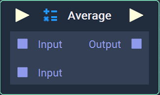
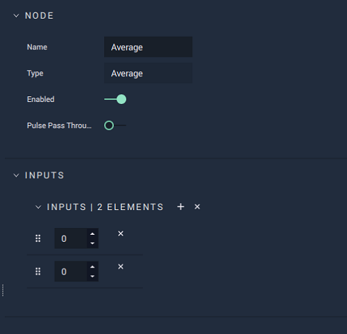

# Average

## Overview

**Average** calculates and returns the _arithmetic mean_ of all of its inputs.

The _arithmetic mean_ is the _sum_ of all values in a set, divided by the total amount of numbers in that set.

[**Scope**](../overview.md#scopes):
*  **Project**, **Scene**, **Function**, **Prefab**

## Attributes

### Inputs

| Attribute | Type | Description |
| :--- | :--- | :--- |
| `Default Inputs` | **Float** | The number of `Input` **Sockets** and their default values, if they have no data connected to them. |

## Inputs

| Input | Type | Description |
| :--- | :--- | :--- |
| _Pulse Input_ \(►\) | **Pulse** | A standard input **Pulse**, to trigger the execution of the **Node**. |
| `Input [n]` | **Float** | The values that will be added together, and divided by the total number of `Input` **Sockets**. |

## Outputs

| Output | Type | Description |
| :--- | :--- | :--- |
| _Pulse Output_ \(►\) | **Pulse** | A standard output **Pulse**, to move onto the next **Node** along the **Logic Branch**, once this **Node** has finished its execution. |
| `Output` | **Float** | The _arithmetic mean_ of all of the `Input` values. |

## External Links

* [_Arithmetic Mean: What it is and How to Find it_](https://www.statisticshowto.datasciencecentral.com/arithmetic-mean/) on Statistics How To.

