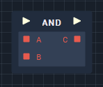
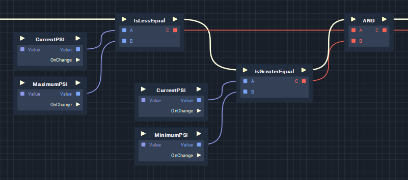

# AND

The **AND** node takes two **Boolean** values as input and returns a **Boolean**. It returns _true_ if both of its inputs are also _true_. If one or both of the inputs are _false_, the node returns _false_. 

| Input 1 | Input 2 | Output |
| :--- | :--- | :--- |
| True | True | True |
| True | False | False |
| False | True | False |
| False | False | False |

## Usage

