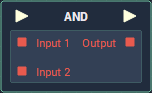

# AND

## Overview

**AND** is a _logical operator_ **Node** which combines two or more **Boolean** expressions to yield a **Boolean** value, based on the inputs' logical relationship to one another. The **Node**outputs a _true_ value if _all_ of its inputs are also _true_. This is the equivalent of the `&&` operator in computer programming.

| Input 1 | Input 2 | Output |
| :--- | :--- | :--- |
| True | True | True |
| True | False | False |
| False | True | False |
| False | False | False |

## Attributes

| Attribute | Type | Description |
| :--- | :--- | :--- |
| `Count` | **Int** | The amount of input **Sockets** the **Node** will have \(the number of **Boolean** values that will be checked\). |

## Inputs

| Input | Type | Description |
| :--- | :--- | :--- |
| _Pulse Input_ \(►\) | **Pulse** | A standard input **Pulse**, to trigger the execution of the **Node**. |
| `Input [n]` | **Bool** | The **Boolean** values to be checked. |

## Outputs

| Output | Type | Description |
| :--- | :--- | :--- |
| _Pulse Output_ \(►\) | **Pulse** | A standard output **Pulse**, to move onto the next **Node** along the _logic branch_, once this **Node** has finished its execution. |
| `Output` | **Bool** | _true_ if _all_ of the input **Boolean** values are also _true_. Otherwise _false_. |

## See Also

* [**Boolean**](./)
* [**Flow Control**](../../flow-control/)

## External Links

* [_Logical operation_](https://www.computerhope.com/jargon/l/logioper.htm) on Computer Hope.

