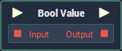

# Overview

The **Bool Value** **Node** stores a **Boolean** value in its internal _state_, which can be defined before the **Project**'s execution and can be retrieved at runtime.

# Attributes

## Miscellaneous

|Attribute|Type|Description|
|---|---|---|
|`Default Value` | **Bool** | The _truth value_ you wish to output.|

# Inputs

|Input|Type|Description|
|---|---|---|
|*Pulse Input* (►)|**Pulse**|A standard **Input Pulse**, to trigger the execution of the **Node**.|
| `Input`| **Bool** | A **Boolean** you wish to add to the **Bool Value** **Node**. |

# Outputs

|Output|Type|Description|
|---|---|---|
|*Pulse Output* (►)|**Pulse**|A standard **Output Pulse**, to move onto the next **Node** along the **Logic Branch**, once this **Node** has finished its execution.|
| `Output` | **Bool** | A **Boolean** variable with the _truth value_ defined in `Default Value`. |

# See Also

* [**Boolean**](./)

