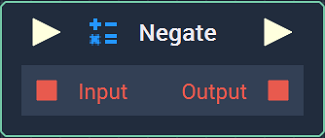

# Negate

## Overview

**Negate** is a _logical operator_ **Node**, which takes a single **Boolean** expression to yield its opposite **Boolean** value.

This is used to mean _NOT_ and is the equivalent of the `!` operator in computer programming.

| Input | Output |
| :--- | :--- |
| True | False |
| False | True |

## Inputs

| Input | Type | Description |
| :--- | :--- | :--- |
| _Pulse Input_ \(►\) | **Pulse** | A standard input **Pulse**, to trigger the execution of the **Node**. |
| `Input` | **Bool** | The **Boolean** value to be negated. |

## Outputs

| Output | Type | Description |
| :--- | :--- | :--- |
| _Pulse Output_ \(►\) | **Pulse** | A standard output **Pulse**, to move onto the next **Node** along the **Logic Branch**, once this **Node** has finished its execution. |
| `Output` | **Bool** | _true_ if `Input` is _false_ or _false_ if `Input` is _true_. |

## See Also

* [**Boolean**](./)
* [**Flow Control**](../../flow-control/)

## External Links

* [_Logical operation_](https://www.computerhope.com/jargon/l/logioper.htm) on Computer Hope.

