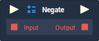
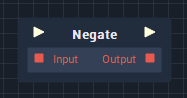

# Overview

**Negate** is a *logical operator* **Node** which takes a single **Boolean** expression to yield a **Boolean** value, which is the opposite of its input. This is used to mean *NOT* and is the equivalent of the `!` operator in computer programming.

| Input | Output |
| :--- | :--- |
| True | False |
| False | True |

# Inputs

|Input|Type|Description|
|---|---|---|
|*Pulse Input* (►)|**Pulse**|A standard input **Pulse**, to trigger the execution of the **Node**.|
|`Input`|**Bool**|The **Boolean** value to be negated.|

# Outputs

|Output|Type|Description|
|---|---|---|
|*Pulse Output* (►)|**Pulse**|A standard output **Pulse**, to move onto the next **Node** along the *logic branch*, once this **Node** has finished its execution.|
|`Output`|**Bool**|*true* if `Input` is *false* or *false* if `Input` is *true*.|

# See Also
- [**Boolean**](README.md)
- [**Flow Control**](../../flow-control/README.md)

# External Links
- [*Logical operation*](https://www.computerhope.com/jargon/l/logioper.htm) on Computer Hope.

<!-- 
# Negate

The **Negate** node takes a single **Boolean** value as an input and returns its inverse. If the input is _true_, it returns _false_ and vice versa.

| Input | Output |
| :--- | :--- |
| True | False |
| False | True | -->