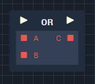
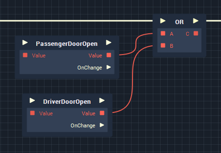

# Overview

**OR** is a *logical operator* **Node** which combines two or more **Boolean** expressions to yield a **Boolean** value, based on the inputs' logical relationship to one another. The **Node** outputs a *true* value if *at least one* of its inputs are also *true*. This is the equivalent of the `||` operator in computer programming.

# Attributes

|Attribute|Type|Description|
|---|---|---|
|`Count`|**Int**|The amount of input **Sockets** the **Node** will have (the number of **Boolean** values that will be checked).|

# Inputs

|Input|Type|Description|
|---|---|---|
|*Pulse Input* (►)|**Pulse**|A standard **Input Pulse**, to trigger the execution of the **Node**.|
|`Input [n]`|**Bool**|The **Boolean** values to be checked.|

# Outputs

|Output|Type|Description|
|---|---|---|
|*Pulse Output* (►)|**Pulse**|A standard **Output Pulse**, to move onto the next **Node** along the **Logic Branch**, once this **Node** has finished its execution.|
|`Output`|**Bool**|*true* if *one or more* of the input **Boolean** values are also *true*. Otherwise *false*.|

# See Also
- [**Boolean**](README.md)
- [**Flow Control**](../../flow-control/README.md)

# External Links
- [*Logical operation*](https://www.computerhope.com/jargon/l/logioper.htm) on Computer Hope.

<!-- # OR

The **AND** node takes two **Boolean** values as input and returns a **Boolean**. It returns _true_ if one or both of the inputs are _true_. The node only returns _false_ if both of its inputs are _false_. 

| Input 1 | Input 2 | Output |
| :--- | :--- | :--- |
| True | True | True |
| True | False | True |
| False | True | True |
| False | False | False |

## Usage

 -->