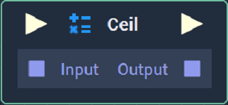
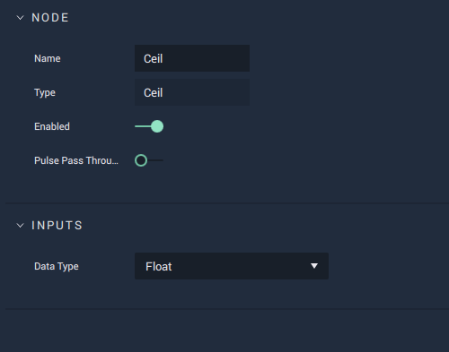

# Ceil

## Overview

**Ceil** takes a numerical value and rounds it _up_ to the nearest whole number. This will affect each _component_ separately with **Data Types** that are comprised of multiple components \(**Vectors** and **Matrices**\).

[**Scope**](../overview.md#scopes): **Project**, **Scene**, **Function**, **Prefab**.

## Attributes

| Attribute | Type | Description |
| :--- | :--- | :--- |
| `Data Type` | **Drop-down** | The type of data that will be plugged into the `Input` **Socket**. |

## Inputs

| Input | Type | Description |
| :--- | :--- | :--- |
| _Pulse Input_ \(►\) | **Pulse** | A standard input **Pulse**, to trigger the execution of the **Node**. |
| `Input` | _Defined in the `Data Type` **Attribute**_. | The value \(per _component_\) to be rounded _up_ to 0 decimal places. |

## Outputs

| Output | Type | Description |
| :--- | :--- | :--- |
| _Pulse Output_ \(►\) | **Pulse** | A standard output **Pulse**, to move onto the next **Node** along the **Logic Branch**, once this **Node** has finished its execution. |
| `Output` | _Defined in the `Data Type` **Attribute**_. | The value of `Input` \(per _component_\) after being _rounded up_ to 0 decimal places. |

## External Links

* [_Floor and Ceiling Functions_](https://www.mathsisfun.com/sets/function-floor-ceiling.html) on Maths is Fun.

