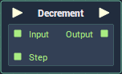

# Overview

**Decrement** decreases a value by a given step and outputs the new value. 

It is comparable to the `--` operator in computer science, except for the fact that the *decrement step* is variable, as opposed to being fixed at 1.

# Attributes

## Inputs

|Attribute|Type|Description|
|---|---|---|
|`Data Type`|**Drop-down**|The type of data that will be plugged into the `Input` **Socket** and will return via its `Output` **Socket**.|
|`Default Step`|*Defined in the `Data Type` **Attribute***.|The default value of the `Step` **Socket**, if no value is provided.|

# Inputs

|Input|Type|Description|
|---|---|---|
|*Pulse Input* (►)|**Pulse**|A standard input **Pulse**, to trigger the execution of the **Node**.|
|`Input`|*Defined in the `Data Type` **Attribute***.|The value to be decremented.|
|`Step`|*Defined in the `Data Type` **Attribute***.|The amount that the value will be decremented by.|

# Outputs

|Output|Type|Description|
|---|---|---|
|*Pulse Output* (►)|**Pulse**|A standard output **Pulse**, to move onto the next **Node** along the **Logic Branch**, once this **Node** has finished its execution.|
|`Output`|*Defined in the `Data Type` **Attribute***.|The decremented value.|

# See Also

- [**Increment**](increment.md)