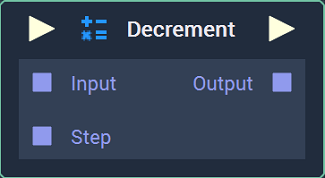
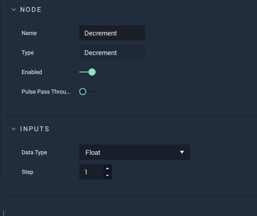

# Decrement

## Overview

**Decrement** decreases a value by a given step and outputs the new value.

It is comparable to the `--` operator in computer science, except for the fact that the _decrement step_ varies, instead of being fixed at 1.

## Attributes

### Inputs

| Attribute | Type | Description |
| :--- | :--- | :--- |
| `Data Type` | **Drop-down** | The type of data that will be plugged into the `Input` **Socket** and returned via its `Output` **Socket**. |
| `Step` | _Defined in the `Data Type` **Attribute**_. | The default value of the `Step` **Socket**, if none is provided. |

## Inputs

| Input | Type | Description |
| :--- | :--- | :--- |
| _Pulse Input_ \(►\) | **Pulse** | A standard input **Pulse**, to trigger the execution of the **Node**. |
| `Input` | _Defined in the `Data Type` **Attribute**_. | The value to be decremented. |
| `Step` | _Defined in the `Data Type` **Attribute**_. | The amount that the value will be decremented by. |

## Outputs

| Output | Type | Description |
| :--- | :--- | :--- |
| _Pulse Output_ \(►\) | **Pulse** | A standard output **Pulse**, to move onto the next **Node** along the **Logic Branch**, once this **Node** has finished its execution. |
| `Output` | _Defined in the `Data Type` **Attribute**_. | The decremented value. |

## See Also

* [**Increment**](increment.md)

