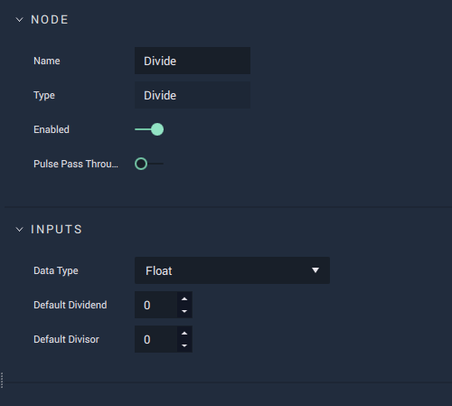

# Divide

## Overview

**Divide** is a _basic arithmetic operation_ **Node**, which divides one number \(_dividend_\) by a second number \(_divisor_\) and outputs the result of the operation \(_quotient_\). This will affect each _component_ separately with **Data Types** that are comprised of multiple components \(**Vectors**\).

This is the equivalent of the division \(`÷` or `/`\) operation in computer science and mathematics.

## Attributes

| Attribute | Type | Description |
| :--- | :--- | :--- |
| `Data Type` | **Drop-down** | The type of data that will be plugged into the `Input` **Sockets**. |
| `Default Dividend` | _Defined in the `Data Type` **Attribute**_. | The left side of the division operation \(the number to be divided\), if no value is provided in the `Dividend` **Socket**. |
| `Default Divisor` | _Defined in the `Data Type` **Attribute**_. | The right side of the division operation \(the number to divide by\), if no value is provided in the `Divisor` **Socket**. |

## Inputs

| Input | Type | Description |
| :--- | :--- | :--- |
| _Pulse Input_ \(►\) | **Pulse** | A standard input **Pulse**, to trigger the execution of the **Node**. |
| `Dividend` | _Defined in the `Data Type` **Attribute**_. | The left side of the division operation \(the number to be divided\). |
| `Divisor` | _Defined in the `Data Type` **Attribute**_. | The right side of the division operation \(the number to divide by\). |

## Outputs

| Output | Type | Description |
| :--- | :--- | :--- |
| _Pulse Output_ \(►\) | **Pulse** | A standard output **Pulse**, to move onto the next **Node** along the **Logic Branch**, once this **Node** has finished its execution. |
| `Quotient` | _Defined in the `Data Type` **Attribute**._ | The result of the division operation. |

