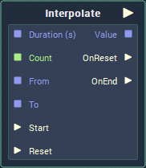

# Interpolate

## Overview

The **Interpolate** **Node** calculates intermediate values between an initial and target value over a set amount of time. It is particularly useful for animations.

## Attributes

### Inputs

| Attribute | Type | Description |
| :--- | :--- | :--- |
| `Data Type` | **Drop-down** | The numerical data type which will be interpolated. |
| `Duration (s)` | **Float** | The length of time between the start and end of the interpolation, if it is not provided in the `Duration (s)` **Socket**. |
| `Interval Time (s)` | **Float** | How frequently the interpolated value is updated and the output **Pulse** is triggered. |
| `From` | _Defined in the `Data Type` **Attribute**_ | The value at the start of the interpolation, if one is not provided in the `From` **Socket**. |
| `To` | _Defined in the `Data Type` **Attribute**_ | The value at the end of the interpolation, if one is not provided in the `To` **Socket**. |

### Interpolation

| Attribute | Type | Description |
| :--- | :--- | :--- |
| `Type` | **Drop-down** | Method used for calculating the intermediate values. |
| `Mode` | **Drop-down** | Whether the interpolation will be performed once, repeated or alternated. |
| `Count` | **Int** \(_not available for `Mode` Once_\) | The number of times that the interpolation will be performed, if it is not provided in the `Count` **Socket**. |
| `Infinite` | **Bool** | Whether the interpolation will be played indefinitely \(this overrides the `Count` **Attribute**\). |

## Inputs

| Input | Type | Description |
| :--- | :--- | :--- |
| `Instance ID` | **InstanceID** | The assigned **Instance** of an **Animation Block**. |
| `Start` | **Pulse** | **Pulse** to trigger the start of the interpolation. |
| `Duration (s)` | **Float** | The length of time between the start and end of the interpolation. |
| `Count` | **Int** | The number of times that the interpolation will be performed. |
| `From` | _Defined in the `Data Type` **Attribute**_ | The value at the start of the interpolation. |
| `To` | _Defined in the `Data Type` **Attribute**_ | The value at the end of the interpolation. |
| `Reset` | **Pulse** | **Pulse** to reset the interpolation. |

## Outputs

| Output | Type | Description |
| :--- | :--- | :--- |
| _Pulse Output_ \(►\) | **Pulse** | A standard **Output Pulse**, to move onto the next **Node** along the **Logic Branch**, once this **Node** has finished its execution. |
| `Instance ID` | **InstanceID** | The previously assigned **Instance** of the **Animation Block**. |
| `Value` | _Defined in the `Data Type` **Attribute**_ | The intermediate value calculated. |
| `OnStart` | **Pulse** | **Pulse** that gets triggered when the interpolation starts. |
| `OnReset` | **Pulse** | **Pulse** that gets triggered when the interpolation resets. |
| `OnEnd` | **Pulse** | **Pulse** that gets triggered when the interpolation ends. |

## See Also

* [**4 Methods of Animation - Interpolation**](../../demo-projects/4-methods-of-animation.md#2-interpolation)
* [**Play Animation**](../incari/animation/playanimation.md)

## External Links

* [_How to use Interpolation Node? part A \| Incari Studio Tutorial_](https://www.youtube.com/watch?v=StFmsERQJTs) on Youtube.
* [_How to use Interpolation Node? part B \| Incari Studio Tutorial_](https://www.youtube.com/watch?v=v-xG_oa0tLI) on Youtube.

