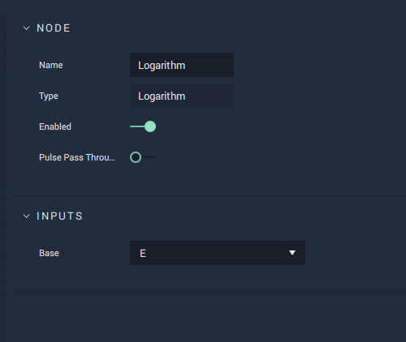

# Logarithm

## Overview

**Logarithm** calculates the _logarithm_ of a number in a chosen base.

This is the inverse function of the [**Power Node**](power.md). Rather than taking a _base_ value, raising it to the power of an _exponent_, and returning the _power_, it takes the _base_ value, along with the _power_, and returns the _exponent_.

[**Scope**](../overview.md#scopes): **Project**, **Scene**, **Function**, **Prefab**.

## Attributes

### Inputs

| Attribute | Type | Description |
| :--- | :--- | :--- |
| `Base` | **Drop-down** | A selection of common bases used in logarithm functions, which are: `2` \(binary\), `e` \(natural\), or `10` \(common\), as well as a `Custom` option, for defining a custom _base_ value. |

### Default

| Attribute | Type | Description |
| :--- | :--- | :--- |
| `Base Value` _\(Made available by the `Base` **Attribute** set to `Custom`\)_ | **Float** | A custom _base_ value. |

## Inputs

| Input | Type | Description |
| :--- | :--- | :--- |
| _Pulse Input_ \(►\) | **Pulse** | A standard input **Pulse**, to trigger the execution of the **Node**. |
| `Input` | **Float** | The number whose logarithm you wish to calculate. |

## Outputs

| Output | Type | Description |
| :--- | :--- | :--- |
| _Pulse Output_ \(►\) | **Pulse** | A standard output **Pulse**, to move onto the next **Node** along the **Logic Branch**, once this **Node** has finished its execution. |
| `Exponent` | **Float** | The _logarithm_ of `Input` in the chosen _base_. |

## External Links

* [_Logarithmic Functions_](https://www.sparknotes.com/math/precalc/exponentialandlogarithmicfunctions/section2/) on sparknotes.

