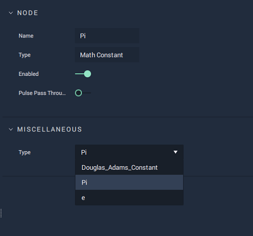

# Math Constant

## Overview

The **Math Constant** **Node** outputs a mathematical constant chosen out of three options: Pi, e \(Euler's number\), and Douglas-Adams Constant \(42\).

*Scope*: **Project**, **Scene**, **Function**, **Prefab**

## Attributes

### Miscellaneous

| Attribute | Type | Description |
| :--- | :--- | :--- |
| `Type` | **Drop-down** | The mathematical constant you wish to output. |

## Outputs

| Output | Type | Description |
| :--- | :--- | :--- |
| `Value` | **Float** | The value of the mathematical constant chosen in `Type`. |

## External Links

* [_Pi_](https://en.wikipedia.org/wiki/Pi) on Wikipedia.
* [_e \(mathematical constant\)_](https://en.wikipedia.org/wiki/E_%28mathematical_constant%29) on Wikipedia.

