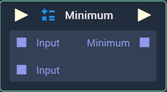
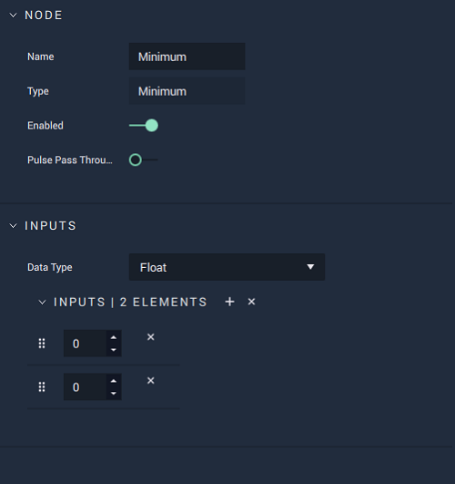

# Minimum

## Overview

**Minimum** compares a set of numerical inputs and returns the lower bound \(minimum value\) in the set.

In case of **Vectors**, it compares the values by component and returns them separately.

## Attributes

| Attribute | Type | Description |
| :--- | :--- | :--- |
| `Data Type` | **Drop-down** | The data type of all `Input` and `Output` **Sockets**. |
| `Inputs` | _Defined in the `Data Type` **Attribute**_. | The number of `Input` **Sockets** and their default values if they have no data connected to them. |

## Inputs

| Input | Type | Description |
| :--- | :--- | :--- |
| _Pulse Input_ \(►\) | **Pulse** | A standard input **Pulse**, to trigger the execution of the **Node**. |
| `Input [n]` | _Defined in the `Data Type` **Attribute**._ | The set of values to get the lower bound from. |

## Outputs

| Output | Type | Description |
| :--- | :--- | :--- |
| _Pulse Output_ \(►\) | **Pulse** | A standard output **Pulse**, to move onto the next **Node** along the **Logic Branch**, once this **Node** has finished its execution. |
| `Minimum` | _Defined in the `Data Type` **Attribute**._ | The minimum value in the set of inputs. |

## External Links

* [_Upper and lower bounds_](https://en.wikipedia.org/wiki/Upper_and_lower_bounds) on Wikipedia.

