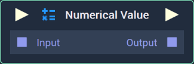
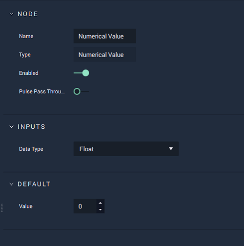

# Numerical Value

## Overview

The **Numerical Value** **Node** generates a number, which can either be an **Int**, **Float**, or **Byte**.

[**Scope**](../overview.md#scopes):
*  **Project**, **Scene**, **Function**, **Prefab**

## Attributes

### Inputs

| Attribute | Type | Description |
| :--- | :--- | :--- |
| `Data Type` | **Drop-down** | Whether an **Int**, **Float**, or **Byte** will be generated. |

### Default

| Attribute | Type | Description |
| :--- | :--- | :--- |
| `Value` | _Defined in the `Data Type` **Attribute**_ | The `Value` that the generated number will have. |

## Inputs

| Input | Type | Description |
| :--- | :--- | :--- |
| _Pulse Input_ \(►\) | **Pulse** | A standard **Input Pulse**, to trigger the execution of the **Node**. |
| `Input` | _Defined in the `Data Type` **Attribute**_ | A number you wish to add to the **Numerical Value** **Node**. |

## Outputs

| Output | Type | Description |
| :--- | :--- | :--- |
| _Pulse Output_ \(►\) | **Pulse** | A standard **Output Pulse**, to move onto the next **Node** along the **Logic Branch**, once this **Node** has finished its execution. |
| `Output` | _Defined in the `Data Type` **Attribute**_ | The generated number. |

## See Also

* [**Byte**](../../objects-and-types/data-types/byte.md)
* [**Float**](../../objects-and-types/data-types/float.md)
* [**Int**](../../objects-and-types/data-types/int.md)

