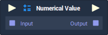

# Overview

The **Numerical Value** **Node** generates a number, which can either be an **Int**, **Float**, or **Byte**.

# Attributes

## Inputs

|Attribute|Type|Description|
|---|---|---|
| `Data Type` | **Drop-down** | Whether an **Int**, **Float**, or **Byte** will be generated. |

## Default

|Attribute|Type|Description|
|---|---|---|
| `Value` | _Defined in the `Data Type` **Attribute**_ | The `Value` that the generated number will have. |

# Inputs

|Input|Type|Description|
|---|---|---|
|*Pulse Input* (►)|**Pulse**|A standard **Input Pulse**, to trigger the execution of the **Node**.|
| `Input` | _Defined in the `Data Type` **Attribute**_ | A number you wish to add to the **Numerical Value** **Node**.|

# Outputs

|Output|Type|Description|
|---|---|---|
|*Pulse Output* (►)|**Pulse**|A standard **Output Pulse**, to move onto the next **Node** along the **Logic Branch**, once this **Node** has finished its execution.|
| `Output` | _Defined in the `Data Type` **Attribute**_ | The generated number. |

# See Also

* [**Byte**](../../getting-started/data-types/byte.md)
* [**Float**](../../getting-started/data-types/float.md)
* [**Int**](../../getting-started/data-types/int.md)

