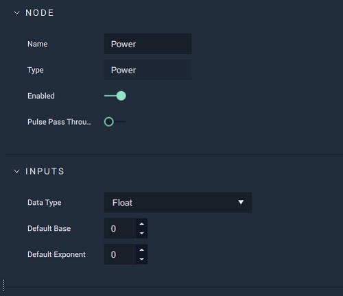

# Power

## Overview

**Power** performs an _exponentiation operation_, meaning that it multiplies the `Base` value against itself _n_ times, with _n_ being defined by `Exponent`.

[**Scope**](../overview.md#scopes): **Project**, **Scene**, **Function**, **Prefab**.

## Attributes

| Attribute | Type | Description |
| :--- | :--- | :--- |
| `Data Type` | **Drop-down** | The type of data that will be plugged into the `Base` and `Exponent` **Sockets**. |
| `Default Base` | _Defined in the `Data Type` **Attribute**_. | The default value of `Base`, if no value is provided in the `Base` **Socket**. |
| `Default Exponent` | _Defined in the `Data Type` **Attribute**_. | The default value of `Exponent`, if no value is provided in the `Exponent` **Socket**. |

## Inputs

| Input | Type | Description |
| :--- | :--- | :--- |
| _Pulse Input_ \(►\) | **Pulse** | A standard input **Pulse**, to trigger the execution of the **Node**. |
| `Base` | _Defined in the `Data Type` **Attribute**_. | The base value that will be multiplied against itself multiple times. |
| `Exponent` | _Defined in the `Data Type` **Attribute**_. | The number of times the `Base` value will be multiplied against itself. |

## Outputs

| Output | Type | Description |
| :--- | :--- | :--- |
| _Pulse Output_ \(►\) | **Pulse** | A standard output **Pulse**, to move onto the next **Node** along the **Logic Branch**, once this **Node** has finished its execution. |
| `Output` | _Defined in the `Data Type` **Attribute**_. | The result of the _exponentiation operation_. |

## See Also

* [**Root**](root.md)

## External Links

* [_Exponentiation: Definition & Examples_](https://study.com/academy/lesson/exponentiation-definition-examples-quiz.html) on Study.com.
* [_Exponentiation_](https://en.wikipedia.org/wiki/Exponentiation) on Wikipedia.

