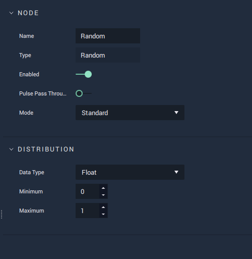

# Random

## Overview

The **Random** **Node** generates a random outcome, usually a number.

This **Node** can be set to three different `Modes` \(**Advanced**, **Expert**, and **Standard**\). Each of these `Modes` offers a different set of **Attributes** that are explained below.

## Attributes

Each `Mode` has a different set of **Attributes**. The `Modes` are: [**Advanced**](random.md#advanced), [**Expert**](random.md#expert), and [**Standard**](random.md#standard).

### Advanced

#### Generator

This `Mode` allows to choose whether the random generator is deterministic or not, and for the deterministic case, the seed to use.

| Attribute | Type | Description |
| :--- | :--- | :--- |
| `Is Deterministic` | **Bool** | Whether the random generator is deterministic or not. |
| `Seed` | **Int** \(_only available when `Is Deterministic` is set to true_\) | The `Seed` to use for the deterministic random generator. |

#### Distribution

This **Mode** has a **Drop-down** menu from which the _probability distribution_ used for the random generator can be chosen. Each option offers its own set of **Attributes** with the _probability distribution_ parameters.

| Attribute | Type | Description |
| :--- | :--- | :--- |
| `Distribution` | **Drop-down** | The _probability distribution_ that the random generator will use. |

Next, the **Attributes** for each _probability distribution_ are described. For each _probability distribution_, the link to its corresponding Wikipedia entry is given.

* [Bernoulli](https://en.wikipedia.org/wiki/Bernoulli_distribution)

_Probability distribution_ of a _random variable_ that can take two values: _true_, with probability p; and _false_, with probability 1-p. When this distribution is chosen, the outcome of the **Node** is a **Boolean**.

| Attribute | Type | Description |
| :--- | :--- | :--- |
| `Probability of 'true'` | **Float** \(_between 0 and 1_\) | The probability that the outcome will be _true_. |

* [Binomial](https://en.wikipedia.org/wiki/Binomial_distribution)

_Probability distribution_ of the number of successes in a sequence of independent experiments, each one with two possible outcomes: success and failure. The parameters for this _probability distribution_ are the number of experiments and the probability of a successful outcome in each one.

| Attribute | Type | Description |
| :--- | :--- | :--- |
| `Data Type` | **Drop-down** | Whether the outcome will be an **Int** or **Byte**. |
| `Probability of 'true'` | **Float** | The probability that the outcome of each trial is _true_. |
| `Number of trials` | **Int** | The number of independent experiments, each one with probability of success `Probability of 'true'`. |

* [Normal](https://en.wikipedia.org/wiki/Normal_distribution)

Symmetric _probability distribution_, with half its values less than the mean and half greater than the mean. The parameters are the mean, which equals the median and the mode, and the standard deviation.

| Attribute | Type | Description |
| :--- | :--- | :--- |
| `Mean` | **Float** | The mean value of the distribution. |
| `Standard deviation` | **Float** | The standard deviation of the distribution. |

* [Poisson](https://en.wikipedia.org/wiki/Poisson_distribution)

Discrete _probability distribution_ that expresses the probability of a given number of events occurring in a specified time period. Its parameter is the mean value.

| Attribute | Type | Description |
| :--- | :--- | :--- |
| `Data Type` | **Drop-down** | Wheter the outcome will be an **Int** or **Byte**. |
| `Mean` | **Float** | The mean value of the distribution. |

* Uniform

_Probability distribution_ in which all the values in an interval are equally likely to be drawn. It can either be [continuous](https://en.wikipedia.org/wiki/Continuous_uniform_distribution) or [discrete](https://en.wikipedia.org/wiki/Discrete_uniform_distribution).

| Attribute | Type | Description |
| :--- | :--- | :--- |
| `Data Type` | **Drop-down** | Whether an **Int**, **Float**, or **Byte** will be generated. |
| `Minimum` | _Defined in the `Data Type` **Attribute**_ | The lower bound of the interval from which the random number will be extracted. |
| `Maximum` | _Defined in the `Data Type` **Attribute**_ | The upper bound of the interval from which the random number will be extracted. |

### Expert

#### Generator

This `Mode` allows to choose from a list of several types of random generators.

| Attribute | Type | Description |
| :--- | :--- | :--- |
| `Generator` | **Drop-down** | The type of random generator to use. |
| `Seed` | **Int** \(_not available for non\_deterministic `Generator`_\) | The `Seed` to use for the random generator. |

#### Distribution

This `Mode` has a **Drop-down** menu from which the _probability distribution_ to be used for the random generator can be chosen. Each option offers its own set of **Attributes** with the _probability distribution_ parameters.

| Attribute | Type | Description |
| :--- | :--- | :--- |
| `Distribution` | **Drop-down** | The _probability distribution_ that the random generator will use. |

Next, the **Attributes** for each _probability distribution_ are described. For each _probability distribution_, the link to its corresponding Wikipedia entry is given.

* [Bernoulli](https://en.wikipedia.org/wiki/Bernoulli_distribution)

_Probability distribution_ of a _random variable_ that can take two values: _true_, with probability p; and _false_, with probability 1-p. When this distribution is chosen, the outcome of the **Node** is a **Boolean**.

| Attribute | Type | Description |
| :--- | :--- | :--- |
| `Probability of 'true'` | **Float** \(_between 0 and 1_\) | The probability that the outcome will be _true_. |

* [Binomial](https://en.wikipedia.org/wiki/Binomial_distribution)

_Probability distribution_ of the number of successes in a sequence of independent experiment, each one with two possible outcomes: success and failure. The parameters for this _probability distribution_ are the number of experiments and the probability of a successful outcome in each one.

| Attribute | Type | Description |
| :--- | :--- | :--- |
| `Data Type` | **Drop-down** | Whether the outcome will be an **Int** or **Byte**. |
| `Probability of 'true'` | **Float** | The probability that the outcome of each trial is _true_. |
| `Number of trials` | **Int** | The number of independent experiments performed, each one with probability of success `Probability of 'true'`. |

* [Cauchy](https://en.wikipedia.org/wiki/Cauchy_distribution)

_Probability distribution_ that resembles a _normal_ distribution but with a taller peak, whose tails decay slower. Its parameters are the location of the peak and the scale - the latter defines its width.

| Attribute | Type | Description |
| :--- | :--- | :--- |
| `Location` | **Float** | Defines where the peak is. |
| `Scale` | **Float** | Half the width of the probability density function at half the maximum height. |

* [Chi\_Squared](https://en.wikipedia.org/wiki/Chi-squared_distribution)

_Probability distribution_ of a sum of the squares of a number of independent normal *random variables*. The number of normal *random variables* is called the degrees of freedom of the Chi-squared _distribution_.

| Attribute | Type | Description |
| :--- | :--- | :--- |
| `Degrees of freedom` | **Float** | Number of independent normal *random variables* that are summed. |

* [Exponential](https://en.wikipedia.org/wiki/Exponential_distribution)

_Probability distribution_ of the time between events in a [Poisson process](https://en.wikipedia.org/wiki/Poisson_point_process). Its parameter is the rate at which the events in the Poison process occur.

| Attribute | Type | Description |
| :--- | :--- | :--- |
| `Rate` | **Float** | Rate at which the events in the Poisson process occur. |

* [Extreme\_Value](https://en.wikipedia.org/wiki/Generalized_extreme_value_distribution)

Limit distribution of properly normalized maxima of a sequence of independent and identically distributed *random variables*.

| Attribute | Type | Description |
| :--- | :--- | :--- |
| `Location` | **Float** | Defines where the peak is. |
| `Scale` | **Float** | Defines how spread out the values are. |

* [Fisher\_F](https://en.wikipedia.org/wiki/F-distribution)

Ratio of two independent *random variables* with chi-squared distributions, each one divided by its corresponding number of degrees of freedom for scaling.

| Attribute | Type | Description |
| :--- | :--- | :--- |
| `Denominator Dof` | **Float** | Degrees of freedom of the chi-squared *random variable* in the denominator. |
| `Numerator DoF` | **Float** | Degrees of freedom of the chi-squared *random variable* in the numerator. |

* [Gamma](https://en.wikipedia.org/wiki/Gamma_distribution)

Maximum entropy probability distribution for a *random variable*, whose mean is the product between the shape and scale, which are the two parameters of the Gamma distribution.

| Attribute | Type | Description |
| :--- | :--- | :--- |
| `Shape` | **Float** | Modifies the shape of the probability distribution. |
| `Scale` | **Float** | Defines how spread out are the values. |

* [Geometric](https://en.wikipedia.org/wiki/Geometric_distribution)

The probability distribution of the number of experiments with a Bernoulli distribution needed to get one success.

| Attribute | Type | Description |
| :--- | :--- | :--- |
| `Data Type` | **Drop-down** | Whether the output is an **Int** or **Byte**. |
| `Probability of 'true'` | **Float** \(_between 0 and 1_\) | The probability of success in the Bernoulli trials. |

* [Lognormal](https://en.wikipedia.org/wiki/Log-normal_distribution)

Probability distribution of a *random variable* whose logarithm has a normal distribution.

| Attribute | Type | Description |
| :--- | :--- | :--- |
| `Mean` | **Float** | The mean value of the logarithm of the distribution. |
| `Standard deviation` | **Float** | The standard deviation of the logarithm of the distribution. |

* [Negative\_Binomial](https://en.wikipedia.org/wiki/Negative_binomial_distribution)

_Probability distribution_ of the number of successes in a sequence of independent experiments, each with two possible outcomes: success and failure, before a specified non-random number of failures occur. The parameters for this _probability distribution_ are the probability of a successful outcome in each experiment and the number of failures until the experiments stop.

| Attribute | Type | Description |
| :--- | :--- | :--- |
| `Data Type` | **Drop-down** | Whether the outcome is an **Int** or **Byte**. |
| `Probability of 'true'` | **Float** \(_between 0 and 1_\) | The probability that the outcome of each trial is _true_. |
| `Number of trials` | **Int** | The number of failures to occur until the experiments stop. |

* [Normal](https://en.wikipedia.org/wiki/Normal_distribution)

Symmetric _probability distribution_, with half its values less than the mean and half greater than the mean. The parameters are the mean, which equals the median and the mode, and the standard deviation.

| Attribute | Type | Description |
| :--- | :--- | :--- |
| `Mean` | **Float** | The mean value of the distribution. |
| `Standard deviation` | **Float** | The standard deviation of the distribution. |

* [Poisson](https://en.wikipedia.org/wiki/Poisson_distribution)

Discrete _probability distribution_ that expresses the probability of a given number of events occurring in a specified time period. Its parameter is the mean value.

| Attribute | Type | Description |
| :--- | :--- | :--- |
| `Data Type` | **Drop-down** | Wheter the outcome will be an **Int** or **Byte**. |
| `Mean` | **Float** | The mean value of the distribution. |

* [Student\_T](https://en.wikipedia.org/wiki/Student%27s_t-distribution)

_Probability distribution_ that arises when estimating the mean of a normally-distributed statistical population with a small sample size and unknown standard deviation. Its parameter is the number of degrees of freedom, which is the number of observations taken from a normal distribution minus one.

| Attribute | Type | Description |
| :--- | :--- | :--- |
| `Degrees of freedom` | **Float** | The number of observations taken from a normal distribution minus one. As it grows, the Student-t distribution approaches a normal distribution. |

* Uniform

_Probability distribution_ in which all the values in an interval are equally likely to be drawn. It can either be [continuous](https://en.wikipedia.org/wiki/Continuous_uniform_distribution) or [discrete](https://en.wikipedia.org/wiki/Discrete_uniform_distribution).

| Attribute | Type | Description |
| :--- | :--- | :--- |
| `Data Type` | **Drop-down** | Whether an **Int**, **Float**, or **Byte** will be generated. |
| `Minimum` | _Defined in the `Data Type` **Attribute**_ | The lower bound of the interval from which the random number will be extracted. |
| `Maximum` | _Defined in the `Data Type` **Attribute**_ | The upper bound of the interval from which the random number will be extracted. |

* [Weibull](https://en.wikipedia.org/wiki/Weibull_distribution)

| Attribute | Type | Description |
| :--- | :--- | :--- |
| `Shape` | **Float** | Defines the shape of the probability distribution. |
| `Scale` | **Float** | Defines how spread out the values of the probability distribution are. |

### Standard

This `Mode` only uses a uniform distribution. It can either be [discrete](https://en.wikipedia.org/wiki/Discrete_uniform_distribution) or [continuous](https://en.wikipedia.org/wiki/Continuous_uniform_distribution).

#### Distribution

| Attribute | Type | Description |
| :--- | :--- | :--- |
| `Data Type` | **Drop-down** | Whether an **Int**, **Float**, or **Byte** will be generated. |
| `Minimum` | _Defined in the `Data Type` **Attribute**_ | The lower bound of the interval from which the random number will be extracted. |
| `Maximum` | _Defined in the `Data Type` **Attribute**_ | The upper bound of the interval from which the random number will be extracted. |

## Inputs

| Input | Type | Description |
| :--- | :--- | :--- |
| _Pulse Input_ \(►\) | **Pulse** | A standard **Input Pulse**, to trigger the execution of the **Node**. |

## Outputs

| Output | Type | Description |
| :--- | :--- | :--- |
| _Pulse Output_ \(►\) | **Pulse** | A standard **Output Pulse**, to move onto the next **Node** along the **Logic Branch**, once this **Node** has finished its execution. |
| `Output` | _Depends on the `Mode` and `Distribution`_ | The random outcome that was generated. |

## External Links

* [_Random number generation_](https://en.wikipedia.org/wiki/Random_number_generation) on Wikipedia.
* [_Pseudorandom number generator_](https://en.wikipedia.org/wiki/Pseudorandom_number_generator) on Wikipedia.
* [_List of probability distributions_](https://en.wikipedia.org/wiki/List_of_probability_distributions) on Wikipedia.

