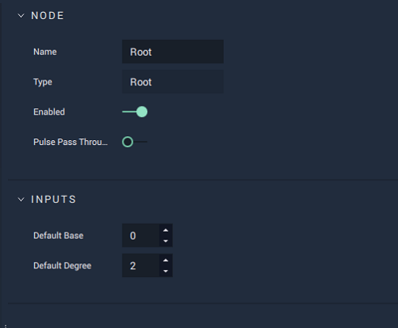

# Root

## Overview

**Root** calculates the _nth root_ of a number, where _n_ is called the _degree of the root_. This **Node** outputs the number which, when raised to the _nth power_, yields the _base_ given as input.

The most common example of **Root** operations is finding the _square_ \(degree 2\) root, or _cubic_ \(degree 3\) _root_ of a number. However, this can also be used for higher degrees.

| `Base` | `Degree` | `Output` |
| :--- | :--- | :--- |
| 9 | 2 | 3 |
| 13824 | 3 | 24 |
| 160000 | 4 | 20 |
| 1024 | 10 | 2 |

[**Scope**](../overview.md#scopes):
*  **Project**, **Scene**, **Function**, **Prefab**

## Attributes

| Input | Type | Description |
| :--- | :--- | :--- |
| `Default Base` | **Float** | The default value of `Base`, if no value is provided in the `Base` **Socket**. |
| `Default Degree` | **Float** | The default value of `Degree`, if no value is provided in the `Degree` **Socket**. |

## Inputs

| Input | Type | Description |
| :--- | :--- | :--- |
| _Pulse Input_ \(►\) | **Pulse** | A standard input **Pulse**, to trigger the execution of the **Node**. |
| `Base` | **Float** | The value you want to find the _nth root_ of. |
| `Degree` | **Float** | The degree of the root. |

## Outputs

| Output | Type | Description |
| :--- | :--- | :--- |
| _Pulse Output_ \(►\) | **Pulse** | A standard output **Pulse**, to move onto the next **Node** along the **Logic Branch**, once this **Node** has finished its execution. |
| `Output` | **Float** | The _nth root_ \(defined in `Degree`\) of `Base`. |

## See Also

* [**Power**](power.md)

## External Links

* [_Root_](https://www.mathopenref.com/root.html) on Math Open Reference.
* [_nth root_](https://en.wikipedia.org/wiki/Nth_root) on Wikipedia.

