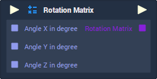

# Overview

The **Rotation Matrix** **Node** receives three angles as inputs and generates a **Matrix4x4** that represents a _rotation_ along the X, Y, and Z axes in the received angles.

# Attributes

## Inputs

|Attribute|Type|Description|
|---|---|---|
| `Default Angle X`| **Float** | The angle, in degrees, along the X axis in which the _rotation_ will be performed, if no value is provided in the `Angle X in degree` **Socket**.  |
| `Default Angle Y`| **Float** | The angle, in degrees, along the Y axis in which the _rotation_ will be performed, if no value is provided in the `Angle Y in degree` **Socket**.  |
| `Default Angle Z`| **Float** | The angle, in degrees, along the Z axis in which the _rotation_ will be performed, if no value is provided in the `Angle Z in degree` **Socket**.  |
# Inputs

|Input|Type|Description|
|---|---|---|
|*Pulse Input* (►)|**Pulse**|A standard **Input Pulse**, to trigger the execution of the **Node**.|
| `Angle X in degree` | **Float** | The angle, in degrees, along the X axis in which the _rotation_ will be performed. |
| `Angle Y in degree` | **Float** | The angle, in degrees, along the Y axis in which the _rotation_ will be performed. |
| `Angle Z in degree` | **Float** | The angle, in degrees, along the Z axis in which the _rotation_ will be performed. |

# Outputs

|Output|Type|Description|
|---|---|---|
|*Pulse Output* (►)|**Pulse**|A standard **Output Pulse**, to move onto the next **Node** along the **Logic Branch**, once this **Node** has finished its execution.|
| `Rotation Matrix` | **Matrix4x4** | A **Matrix4x4** representing _rotations_ along the X, Y, and Z axes in the given angles. |

# External Links

* [_Rotation matrix_](https://en.wikipedia.org/wiki/Rotation_matrix) on Wikipedia.

